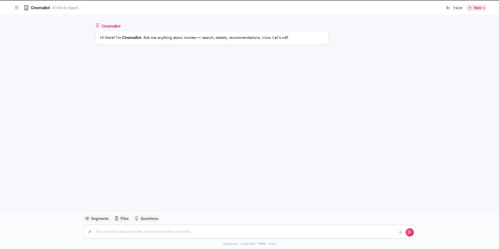
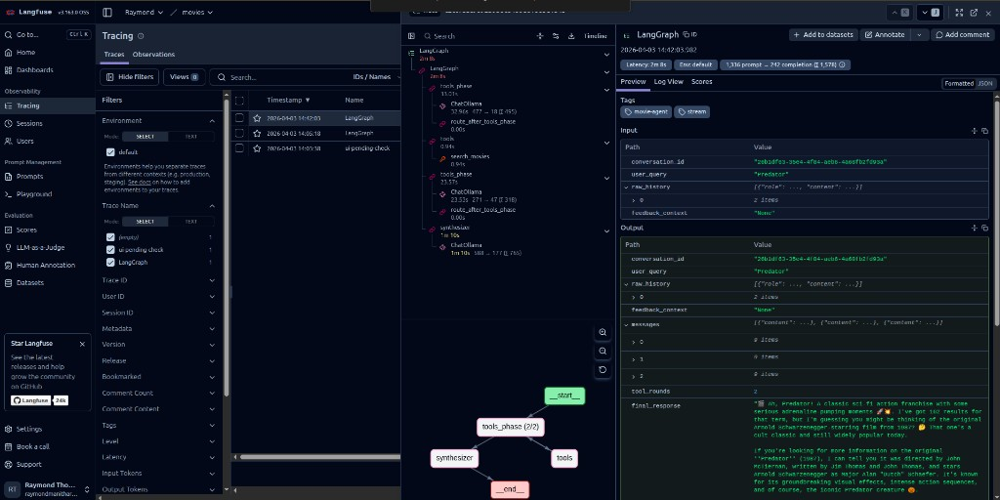

# 🎬 Movie Agent

Movie Agent is a local-first AI movie assistant built with FastAPI + LangGraph + Ollama, with Redis semantic cache and Langfuse observability.

This README documents:
- system design and control flow
- node-by-node technical behavior
- class/function responsibilities
- packages and runtime dependencies
- screenshot-backed tracing and UI references

For a **folder tree and architecture overview** (diagrams, layering, request flow), see [docs/ARCHITECTURE.md](docs/ARCHITECTURE.md).

## Product Screenshots

### App UI (CinemaBot)


### Langfuse Trace Graph + Inputs/Outputs


## Overall System Design

```text
Client (React + WS)
   -> FastAPI Controllers
      -> ChatService
         -> Redis semantic cache (+ optional LLM verifier)
         -> LangGraph agent pipeline
             context_builder (conditional summary + optimize)
             -> tools_decision (single pass)
             -> optional tool_executor (ToolNode)
             -> synthesizer
             -> eval_gate (rule-first)
             -> optional quality_eval (LLM judge)
             -> (retry synthesizer with fallback model OR accept)
         -> persist messages + optional Redis write-back
      -> Repositories (SQLAlchemy async/MySQL)
```

### Layering
- `controllers` -> HTTP/WS transport only
- `services` -> orchestration/business logic
- `repositories` -> database access
- `services/agent` -> graph, prompts, tools, quality, tracing metadata
- `core` -> app config, logging, DB/Redis setup, Langfuse setup

## User Flow

1. User sends message from composer.
2. WebSocket `/api/v1/chat/ws` starts streaming turn.
3. `ChatService.stream_message()` optionally tries semantic cache.
4. If cache hit:
   - evaluate quality with shared quality gate
   - if acceptable: return cached answer immediately
   - else: continue to graph
5. Graph executes:
   - context builder (summary only when needed + prompt optimization)
   - single-pass tool decision + optional tool execution
   - synthesize user-facing response
   - fast rule-based eval gate
   - conditional LLM quality evaluation only on low-confidence cases
   - if low quality and retries remain: regenerate with fallback model
6. Final response is persisted and streamed to UI.
7. Response can be regenerated from UI (same last user message, same conversation).

## Control Flow (Graph)

```text
START
  -> context_builder
  -> tools_decision
      -> if tool call exists: tool_executor -> synthesizer
      -> else: synthesizer
  -> eval_gate
      -> if rule pass: END
      -> else: quality_eval
          -> if score >= QUALITY_MIN_SCORE: END
          -> else if synthesis_pass_count < MAX_SYNTHESIS_PASSES: synthesizer
          -> else: END
```

## Technical Reference: Agent Nodes

### `context_builder(state, config)`
- File: `app/services/agent/agent.py`
- Optionally summarizes only when history is above threshold.
- Always emits an optimized task instruction before downstream reasoning.

### `tools_decision(state, config)`
- Single-pass tool reasoning (`bind_tools`) with no recursive tool loop by default.
- Emits zero or one tool actions.

### `tool_executor` (LangGraph `ToolNode`)
- Executes registered async tools:
  - `search_movies(query)`
  - `get_movie_details(imdb_id)`
- Tool outputs are appended as `ToolMessage` into graph state

### `synthesizer(state, config)`
- Creates polished user response without tool bindings
- Uses:
  - `MOVIE_AGENT_SYSTEM_PROMPT`
  - `history_summary`
  - `optimized_prompt`
  - flattened tool transcript
  - prior `quality_feedback` on retries
- Retry model behavior:
  - first pass: `OLLAMA_MODEL`
  - retry pass: `OLLAMA_SYNTH_FALLBACK_MODEL` or `OLLAMA_CODE_MODEL`

### `eval_gate(state, config)`
- Rule-first confidence gate (empty/too-short/missing tool-evidence checks).
- Invokes expensive quality LLM only when necessary.

### `quality_eval(state, config)` (conditional)
- Calls shared helper `evaluate_answer_quality(...)` only after `eval_gate` asks for it
- Output: `quality_score`, `quality_feedback`
- Route rules:
  - accept if score >= `QUALITY_MIN_SCORE`
  - retry synth if under threshold and pass count < `MAX_SYNTHESIS_PASSES`

## Shared Helper Classes / Functions

### `ChatService` (`app/services/chat_service.py`)
- Primary orchestrator for sync and streaming chat
- Important methods:
  - `_try_semantic_cache(message)` -> vector lookup + optional verification
  - `process_message(...)` -> HTTP flow
  - `stream_message(..., regenerate=False)` -> WS streaming flow
  - `_agent_state_payload(...)` -> graph input packaging
  - `_make_langfuse_handler()` -> per-request callback handler
- Regenerate mode:
  - reuses latest user message from DB
  - skips cache by design
  - appends new assistant response only

### `evaluate_answer_quality(...)` (`app/services/agent/quality.py`)
- Shared quality gate for:
  - cache path
  - graph output
  - regeneration output
- Uses same model family and deterministic parsing into `(score, reason)`

### `MessageRepository` (`app/repositories/conversation_repo.py`)
- `get_recent_by_conversation(...)` for rolling context
- `get_conversation_context(conversation_id, token_limit)` for token-budgeted context reads
- `get_latest_user_message(conversation_id)` for regenerate
- `add_message(...)`, `set_message_feedback(...)`, `get_liked_messages(...)`

### Agent-run repositories (`app/repositories/agent_run_repo.py`)
- `AgentRunRepository`:
  - `create_run(...)` / `finalize_run(...)`
  - `add_step(...)`, `add_tool_call(...)`, `add_quality_evaluation(...)`
  - analytics reads: `get_tool_usage_stats(...)`, `get_run_failure_breakdown(...)`
- `CacheAuditRepository`:
  - `log_decision(...)`
  - `decision_stats()`
- `ConversationSummaryRepository`:
  - `get_latest(...)`
  - `upsert_next(...)`

### Trace helpers (`app/services/agent/trace_events.py`)
- `build_agent_run_config(...)` -> tags + metadata + callbacks
- `append_trace_from_astream_event(...)` -> compact UI timeline
- `try_get_observability_trace_id(...)` -> Langfuse trace id extraction

## API Surface

### Auth (Firebase ID token)
- **Chat** (`POST /api/v1/chat`, WebSocket `/ws`, and read/list/delete/analytics): **optional** auth. Omit `Authorization` and omit or leave `id_token` empty for anonymous chat; conversations are stored with `user_id` null.
- **Feedback** (`POST .../feedback`) and **`GET /api/v1/auth/me`**: require `Authorization: Bearer <firebase_id_token>`.
- WebSocket first JSON may include `id_token`, `message`, `conversation_id`, `regenerate`.
- Set `AUTH_DEV_BYPASS=true` on the backend and `VITE_AUTH_DEV_BYPASS=true` in the frontend for local development without Firebase (full chat + feedback without real tokens).

**UX**: Users can chat without signing in; like/dislike opens sign-in and only then persists feedback. Feedback is stored only for messages in conversations owned by the signed-in user (not for prior anonymous threads unless you add a “claim” flow later).

| Method | Endpoint | Description |
|---|---|---|
| `GET` | `/api/v1/auth/me` | Current user profile (synced from Firebase claims) |

### Chat
| Method | Endpoint | Description |
|---|---|---|
| `POST` | `/api/v1/chat` | Sync message-response |
| `GET` | `/api/v1/chat/conversations` | List conversations |
| `GET` | `/api/v1/chat/{conversation_id}` | Conversation with messages |
| `DELETE` | `/api/v1/chat/{conversation_id}` | Delete conversation |
| `POST` | `/api/v1/chat/message/{message_id}/feedback` | Like/dislike assistant message |
| `WS` | `/api/v1/chat/ws` | Streaming chat; first frame JSON includes `id_token`, `message`, optional `conversation_id`, optional `regenerate` |
| `GET` | `/api/v1/chat/analytics/tool-usage` | Tool usage and latency aggregates |
| `GET` | `/api/v1/chat/analytics/run-failures` | Node/step status breakdown |
| `GET` | `/api/v1/chat/analytics/cache-decisions` | Cache hit/reject/miss stats |

### Movies
| Method | Endpoint | Description |
|---|---|---|
| `GET` | `/api/v1/movies/search?q=...` | Search movie titles |
| `GET` | `/api/v1/movies/{imdb_id}` | Fetch movie detail |

## Core Packages Used

From `requirements.txt`:
- `fastapi`, `uvicorn` -> API + runtime
- `langchain`, `langgraph`, `langchain-ollama`, `langchain-community` -> agent pipeline
- `langfuse` -> observability/tracing
- `sqlalchemy[asyncio]`, `aiomysql` -> persistence
- `redis` -> semantic cache storage/search
- `httpx` -> external API clients
- `pydantic-settings` -> environment-driven config
- `python-dotenv` -> local env loading
- `firebase-admin` -> verify Firebase ID tokens for auth

## Persistence Model (Data-Layer-First)

- `users` -> Firebase-linked accounts (`firebase_uid`, email, profile fields)
- `conversations` -> `user_id` nullable (`NULL` = anonymous guest thread; scoped list/history only when signed in)

New intelligence tables:
- `agent_runs` -> one row per request path (`graph`, `cache`, `regenerate`)
- `agent_run_steps` -> node/event lifecycle snapshots
- `tool_calls` -> normalized tool execution rows
- `quality_evaluations` -> shared quality gate outputs
- `cache_decisions` -> auditable cache acceptance/rejection logs
- `conversation_summaries` -> rolling summary snapshots (versioned)

CQRS-style Redis projections:
- `proj:conversation:{id}:context` -> latest summary + latest run quality
- `proj:run:{id}` -> compact run status/progress snapshot

## Environment Configuration (Key Runtime Flags)

```bash
# Base model
OLLAMA_MODEL=llama3.1

# Per-step model routing (optional)
OLLAMA_CONTEXT_MODEL=
OLLAMA_TOOL_DECISION_MODEL=
OLLAMA_SYNTH_MODEL=
OLLAMA_QUALITY_MODEL=

# Retry model when quality fails
OLLAMA_SYNTH_FALLBACK_MODEL=
OLLAMA_CODE_MODEL=deepseek-coder

# Quality controls
QUALITY_MIN_SCORE=6
MAX_SYNTHESIS_PASSES=2

# Conditional summary/eval controls
HISTORY_SUMMARY_MIN_MESSAGES=8
QUALITY_RULE_MIN_CHARS=40

# Semantic cache verification
SEMANTIC_CACHE_VERIFY=true

# Firebase (production): service account JSON path or FIREBASE_CREDENTIALS_JSON
# AUTH_DEV_BYPASS=true skips verification (tests / local only)
AUTH_ENABLED=true
AUTH_DEV_BYPASS=false
FIREBASE_PROJECT_ID=
FIREBASE_CREDENTIALS_PATH=
```

### Firebase setup (email/password + Google)

1. Create a Firebase project and add a **Web** app; copy the config into `frontend/.env` as `VITE_FIREBASE_*`.
2. Enable **Email/Password** and **Google** sign-in providers in Authentication.
3. Add **Authorized domains** (e.g. `localhost`, your production host).
4. In Project settings → Service accounts, generate a private key JSON and set `FIREBASE_CREDENTIALS_PATH` (or `FIREBASE_CREDENTIALS_JSON`) in the API `.env`. Set `FIREBASE_PROJECT_ID` to match the project.
5. Existing databases created before `users` / `conversation.user_id` need a manual migration (add tables/column and backfill or start fresh).
6. To allow **anonymous** chats, `conversations.user_id` must be nullable. Example for MySQL:

```sql
ALTER TABLE conversations MODIFY COLUMN user_id VARCHAR(36) NULL;
```

## Langfuse Observability

Run local stack:

```bash
docker compose up -d
```

Recommended config:

```bash
LANGFUSE_PUBLIC_KEY=pk-lf-...
LANGFUSE_SECRET_KEY=sk-lf-...
LANGFUSE_HOST=http://localhost:3001
LANGFUSE_PROJECT_NAME=movie-agent
```

Important notes:
- this project initializes Langfuse client on startup and uses per-request callback handlers
- traces are flushed after each graph run
- if OTLP endpoint `/api/public/otel/v1/traces` returns `404`, you are likely pointing to Langfuse v2

## Quick Start

```bash
python -m venv venv
source venv/bin/activate
pip install -r requirements.txt
cp .env.example .env
uvicorn app.main:app --reload --host 0.0.0.0 --port 8000
```

## Tests

```bash
pip install pytest pytest-asyncio
pytest tests/ -v
```
