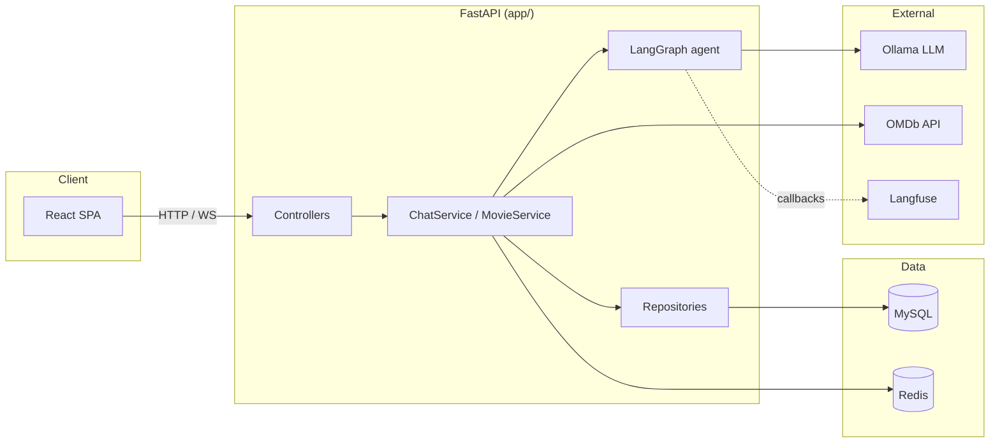
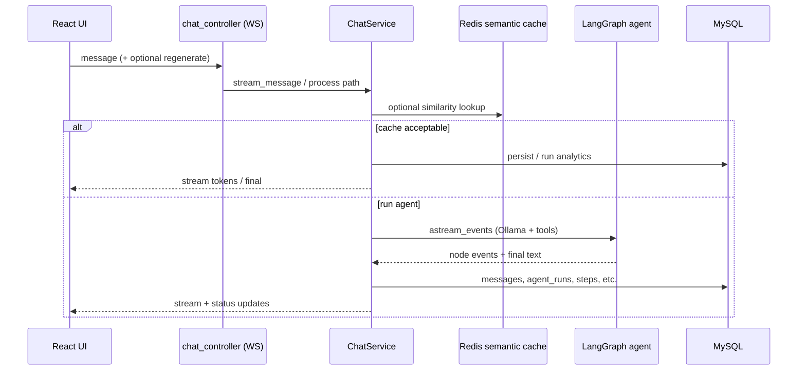

# Movie Agent — Architecture & Folder Structure

This document describes how the **Movie Agent** repository is organized and how the main pieces fit together at runtime. For environment variables, API tables, and node-level prompts, see the root [`README.md`](../README.md).

---

## 1. What this application is

**Movie Agent** is a local-first stack:

- **Backend**: FastAPI exposes REST + WebSocket chat, persists conversations in **MySQL** (via SQLAlchemy async), uses **Redis** for semantic cache and read projections, and runs a **LangGraph** agent on **Ollama**.
- **Observability**: **Langfuse** traces LangChain/LangGraph runs when keys and host are configured.
- **Frontend**: **Vite + React + TypeScript** SPA (CinemaBot UI) talks to the API and WebSocket; production build can be served from `static/` (see `app/main.py`).

---

## 2. High-level architecture

Authentication uses **Firebase Auth** on the client (email/password + Google). Chat works **without** a token (anonymous conversations have `user_id` null); signed-in users get scoped lists and persisted **like/dislike** feedback. The API verifies **Firebase ID tokens** with the Firebase Admin SDK for protected routes. For local development without Firebase, `AUTH_DEV_BYPASS` / `VITE_AUTH_DEV_BYPASS` can be enabled (never in production).



### Layering (backend)

| Layer | Role |
|--------|------|
| `app/controllers/` | HTTP/WebSocket routing, request/response mapping only |
| `app/services/` | Orchestration: chat turns, cache, graph invocation, projections |
| `app/repositories/` | Async DB and Redis access |
| `app/models/` | SQLAlchemy ORM entities |
| `app/schemas/` | Pydantic request/response models |
| `app/services/agent/` | Graph definition, tools, prompts, quality, trace helpers |
| `app/core/` | Settings, DB/Redis lifecycle, logging, Langfuse bootstrap |
| `app/utils/` | HTTP clients (e.g. OMDb) |

---

## 3. Typical chat request flow



**Order of operations (conceptual)**:

1. **Semantic cache** (optional): vector-style lookup in Redis; shared quality gate may accept or reject the cached answer.
2. **LangGraph**: `context_builder` → `tools_decision` → optional `tool_executor` → `synthesizer` → `eval_gate` → optional `quality_eval` → possible **synthesizer retry** with fallback model.
3. **Persistence**: conversation messages, `AgentRun` / steps / tool calls / quality / cache audit rows; Redis projections for fast reads.

---

## 4. Repository folder structure

Below is the **source-oriented** layout (generated for this repo). It **excludes** virtualenv, `node_modules`, `__pycache__`, `.git`, and similar generated paths.

```text
movie-agent/
├── README.md
├── requirements.txt
├── docker-compose.yml          # Local Langfuse (and related) stack
├── .env.example
├── app/
│   ├── main.py                 # FastAPI factory, lifespan, routers, static mount
│   ├── controllers/
│   │   ├── auth_controller.py  # GET /auth/me (Bearer token)
│   │   ├── chat_controller.py  # REST + WebSocket chat, analytics routes
│   │   ├── movie_controller.py
│   │   └── health_controller.py
│   ├── core/
│   │   ├── auth.py             # Firebase ID token verify + claim mapping
│   │   ├── firebase_admin.py   # Firebase Admin SDK init
│   │   ├── config.py           # Pydantic settings / env
│   │   ├── database.py
│   │   ├── redis.py
│   │   ├── dependencies.py     # FastAPI Depends() wiring
│   │   ├── exceptions.py
│   │   ├── logging.py
│   │   ├── langfuse_setup.py
│   │   └── react_dev.py        # Optional dev: spawn React dev server
│   ├── models/
│   │   ├── base.py
│   │   ├── user.py             # Firebase-linked users
│   │   ├── conversation.py
│   │   ├── movie.py
│   │   └── agent_run.py        # AgentRun, steps, tools, quality, cache audit, summaries
│   ├── repositories/
│   │   ├── base.py
│   │   ├── conversation_repo.py
│   │   ├── movie_repo.py
│   │   ├── redis_repo.py       # Semantic cache + projection keys
│   │   └── agent_run_repo.py
│   ├── schemas/
│   │   ├── chat.py
│   │   ├── movie.py
│   │   └── common.py
│   ├── services/
│   │   ├── chat_service.py     # Main orchestration for sync + streaming chat
│   │   ├── movie_service.py
│   │   ├── projection_service.py
│   │   └── agent/
│   │       ├── agent.py        # LangGraph: nodes, routing, LLM per step
│   │       ├── state.py        # AgentState
│   │       ├── prompts.py
│   │       ├── tools.py        # LangChain tools (search, details)
│   │       ├── quality.py      # Shared quality evaluation + rule gate
│   │       ├── cache_verification.py
│   │       ├── trace_events.py # Langfuse / trace metadata helpers
│   │       ├── callbacks.py
│   │       └── langfuse_flush.py
│   └── utils/
│       └── omdb_client.py
├── frontend/                   # Vite + React + TS (CinemaBot)
│   ├── src/
│   │   ├── main.tsx
│   │   ├── App.tsx
│   │   ├── api/
│   │   ├── components/       # Chat UI, trace drawer, composer
│   │   ├── hooks/            # useChatWebSocket
│   │   └── types/
│   ├── dist/                 # Production build output (when built)
│   └── package.json
├── docs/
│   ├── ARCHITECTURE.md         # This file
│   └── images/                 # README screenshots (relative paths)
├── tests/
│   ├── conftest.py
│   ├── test_repositories.py
│   ├── test_schemas.py
│   ├── test_agent_run_repositories.py
│   └── test_latency_refactor.py
├── documentation/            # Additional notes (legacy / extra README)
├── static/                     # Runtime static root (created if missing; can hold SPA build)
├── debug_chat.py
└── debug_streaming.py
```

### Regenerating the tree locally

To print an up-to-date tree while skipping heavy directories:

```bash
cd /path/to/movie-agent
find . \( -path ./venv -o -path ./.git -o -path './frontend/node_modules' -o -path '*/__pycache__' \) -prune -o -type f -print | sed 's|^\./||' | sort
```

---

## 5. LangGraph control flow (summary)

Aligned with the implementation in `app/services/agent/agent.py`:

```text
START
  → context_builder
  → tools_decision
      → if tool call: tool_executor → synthesizer
      → else: synthesizer
  → eval_gate
      → if rules pass: END
      → else: quality_eval
          → if score OK: END
          → elif retries left: synthesizer (fallback model path)
          → else: END
```

---

## 6. Related documentation

- Root [`README.md`](../README.md) — quick start, env flags, API table, Langfuse notes, screenshots.
- [`docker-compose.yml`](../docker-compose.yml) — local observability stack.
