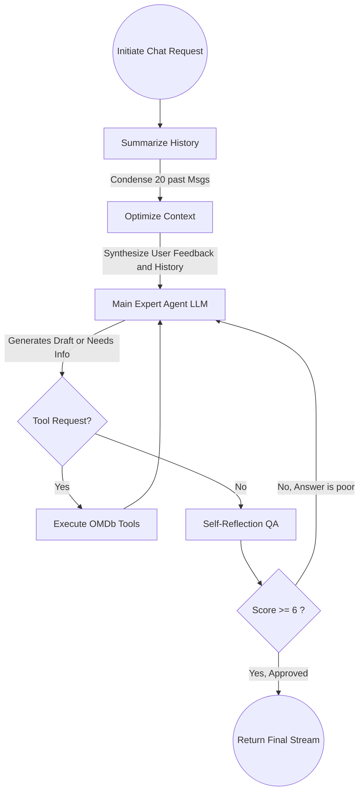

# Movie Agent Architecture Documentation

Welcome to the **Movie Agent** core documentation! This document serves as a comprehensive breakdown structure of the application, explaining exactly what each internal component does, why it exists, and the tools being utilized across the stack.

## 🛠 Tech Stack Overview

| Tool / Technology | Purpose |
|-------------------|---------|
| **FastAPI** | High-performance asynchronous Python web framework used for crafting both the REST APIs and the WebSocket interfaces. |
| **Uvicorn** | ASGI Web Server implementation used to serve the FastAPI application. |
| **LangChain Core & LangGraph** | The orchestrator framework for constructing the ReAct (Reasoning and Acting) Agent logic, tracking chat message states, and handling Tool utilization. |
| **Ollama** | Local LLM Engine running `llama3.1` to generate dynamic chat inferences natively without external API fees, and `nomic-embed-text` for producing AI Vector Embeddings. |
| **SQLAlchemy** | The Object-Relational Mapper (ORM) mapped asynchronously (`aiomysql`) into a local database instance to persist user conversations, chat histories, and standard movie details. |
| **Redis** | Native memory caching engine. Redis Stack (`redis-py`) is manipulated specifically to leverage RediSearch `VECTOR` types tracking nearest neighbor similarity (HNSW arrays). |
| **OMDb API** | External JSON API accessed as a fallback database to fetch live, verifiable metadata about specific movies. |

---

## 📁 Repository Structure and Components

### `app/main.py`
The absolute entry point to the application. It instantiates the FastAPI app instance, binds application Lifespan logic (verifying MySQL SQL schemas, configuring the Redis connection bindings, printing boot statuses), and defines routing includes.

### `app/core/` *(Core Configurations & Handlers)*
- **`config.py`**: A unified Pydantic settings block that manages and exports all `.env` system properties internally so the app scales without hardcoded strings.
- **`database.py`**: Binds the asynchronous MySQL SQL engine natively into SQLAlchemy. Provides the sessionmakers bridging Data Access models.
- **`redis.py`**: Initializes the global `redis.asyncio` client mapped into `app.core`. Evaluates initialization commands to drop broken indexes and enforces `FT.CREATE` parameters to establish the vector `idx:movies` semantic search architecture mapped at `768` floats.
- **`exceptions.py` & `logging.py`**: Handlers that provide structured system printouts and capture global API HTTP interrupts securely.

### `app/models/` *(Database Schemas Structure)*
- Responsible exclusively for mapping Python classes into SQL table columns dynamically using SQLAlchemy. Tracks things such as `Conversation`, `Message`, and relational text cached items (`CachedMovie`). 

### `app/schemas/` *(Pydantic Route Validation)*
- Defines strictly typed objects that get returned to REST API JSON (e.g., `ChatResponse`, `MovieSearchResult`). This securely scrubs native Object memory representations out of the browser's view.

### `app/repositories/` *(Data Access Layers)*
- **`conversation_repo.py` & `message_repo.py`**: Standard SQL fetch operations abstracted away from business logic. Performs asynchronous inserts to capture ongoing Chat Histories seamlessly.
- **`movie_repo.py`**: Looks up previously scraped OMDb query hits dynamically stored within MySQL text models to limit network strain.
- **`redis_repo.py`**: Abstract proxy class specific for **Semantic Caching**. When initialized with the Redis client, it parses mathematical float structures via `struct.pack` and executes raw RediSearch `FT.SEARCH` routines natively comparing K-Nearest Neighbor semantic closeness of chat text.

### `app/services/` *(Orchestrators & Logic)*
This is where the actual business and interaction patterns are handled.
- **`chat_service.py`**: The heavy lifter! Handles processing text strings locally for both `POST` REST routing and native `WebSocket` chunk streaming. Evaluates whether an incoming question has a `Score < 0.2` native math similarity through Redis semantic cache. If it is entirely unique, it drops into `ainvoke` Langchain context and saves the results backward.
- **`movie_service.py`**: Abstraction built specifically to query internal text caching before wrapping Python HTTP requests to access live external data against **`OMDbClient`** definitions.
- **`agent/agent.py` & `agent/prompts.py`**: Defines the `create_react_agent` instances and loads our precise prompt models guiding the `llama3.1` LLM structure to securely evaluate movie-related questions and restrict spam variables.
- **`agent/tools.py`**: Evaluates custom `@tool` functions that bind directly to `movie_service.py`. The LLM has the intrinsic ability to autonomously decide to invoke these whenever it recognizes it lacks context gracefully!

### `app/controllers/` *(Routers)*
- Defines the `APIRouter` path injections linking the web requests dynamically into `services` through Dependency Injection (preventing uninstantiated memory failures).

---

## ⚡ The Semantic Caching Flow ("How the Matrix Thinks")

1. The User issues a text sentence through `POST /chat` or `/ws`.
2. Python converts the sentence string using `nomic-embed-text` against the Ollama HTTP layer into a `768` node mathematical context vector natively representing the user's intent algorithmically.
3. Redis computes the Euclidean COSINE distance between the user vector and all globally stored queries in the `idx:movies` native memory space instantly.
4. If a prior question was close enough (distance `< 0.2`), Python totally bypasses LLM resource spinning and perfectly injects the `response` string originally given backward natively.
5. If the cache misses, the prompt connects natively to the `LLM`, LangChain identifies the necessity of Tools natively checking `OMDb`, an answer is successfully articulated, and the brand new Prompt->Response+Vector mappings are instantly `HSET` tracked into Redis database for the future!

---

## 🧭 LangGraph Self-Reflection Flow (The custom `StateGraph`)

Instead of relying on standard out-of-the-box prebuilt agents, this application heavily manipulates the LangGraph execution cycle to enforce analytical steps ensuring superior Context retrieval and autonomous Self-Reflection Evaluation.

### Custom Graph Lifecycle (`AgentState`)

When a user submits a query that misses the `Redis` cache layer, the system transitions into the Custom Agent Graph which traces the following nodes iteratively:

1. **`Summarize History`**: Actively compresses up to 20 past conversation turns via LLM directly so the AI context window never becomes overwhelmed.
2. **`Optimize Context`**: Analyzes the new user question, mixes it with the History Summary, and actively integrates favorable User Feedback Patterns natively tracking `thumbs-up` responses in the MySQL database.
3. **`Main Agent`**: The primary entity attempting to satisfy the optimized prompt. 
4. **`Evaluate (Self Reflection)`**: An explicit layer that acts as Quality Assurance. It grades the draft response. If it evaluates that the LLM is hallucinating or producing an unhelpful "I don't know" style answer without using tools, it natively fails the draft and forcibly rewires the `StateGraph` back to the `Main Agent` demanding a better fix.
